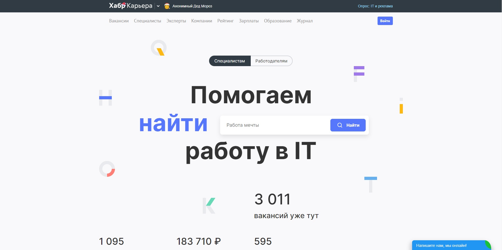
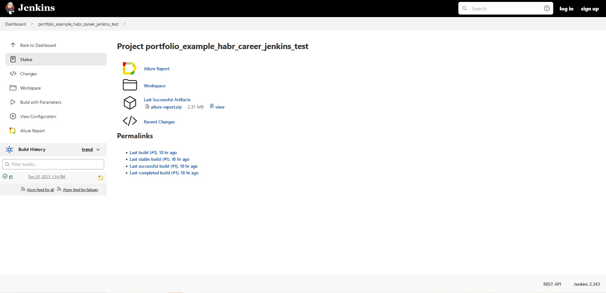
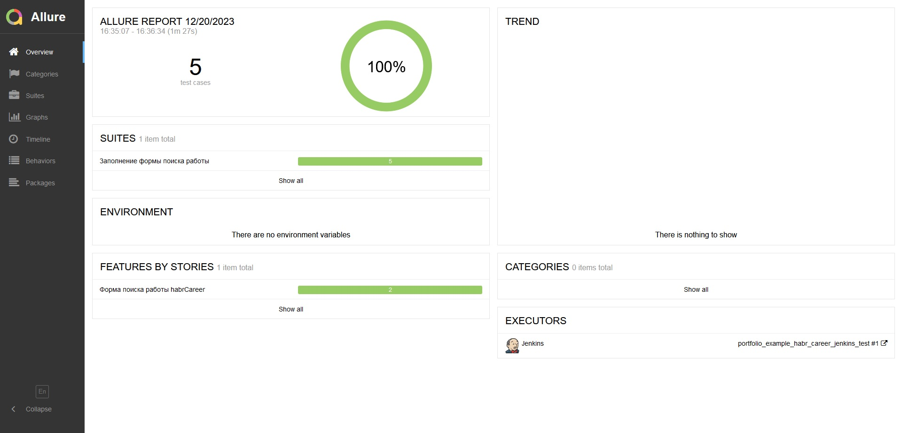
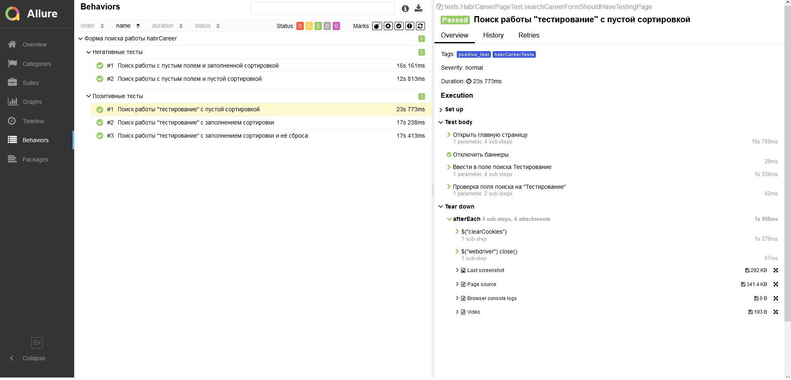

# Проект по автоматизации тестирования для [ХабрКарьера](https://career.habr.com/)




## :clipboard: Содержание:
* <a href="#tools">Используемый стек</a>
* <a href="#cases">Примеры автоматизированных тест-кейсов</a>
* <a href="#console">Запуск из терминала</a>
* <a href="#jenkins">Сборка в Jenkins</a>
* <a href="#allure">Allure отчет</a>


____
<a id="tools"></a>
## :computer:<a name="Используемый стек">**Используемый стек:**</a>

<p align="center">
<a href="https://www.java.com/"></a>
<a href="https://selenide.org/"></a>
<a href="https://aerokube.com/selenoid/"></a>
<a href="https://github.com/allure-framework/allure2"></a>
<a href="https://qameta.io/"></a>
<a href="https://gradle.org/"></a>
<a href="https://github.com/"></a>
<a href="https://www.jenkins.io/"></a>
<a href="https://web.telegram.org/a/"></a>
<!-- <a href="https://www.atlassian.com/ru/software/jira/"></a> -->
</p>

____
<a id="cases"></a>
## <a name="Примеры автоматизированных тест-кейсов">**Примеры автоматизированных тест-кейсов:**</a>
____
-  *Поиск работы c пустым полем и пустой сортировкой*
-  *Поиск работы "тестирование" c пустой сортировкой*
-  *Поиск работы \"тестирование\" с заполнением сортировки*
-  *Поиск работы c пустым полем и заполненной сортировкой*
-  *Поиск работы "тестирование" с заполнением сортировки и её сброса*


<a id="console"></a>
## :keyboard: Запуск автотестов

***Локальный запуск тестов:***
```bash  
gradle clean test_suite
```
____
<a id="jenkins"></a>
## </a><a name="Сборка"></a>Сборка в [Jenkins](https://jenkins.autotests.cloud/job/portfolio_example_habr_career_jenkins_test/)</a>
## <a name="Удаленный запуск автотестов">**Для запуска сборки необходимо перейти в раздел `Build with Parameters` выбрать нужные вам параметры и нажать кнопку `Build`.**</a>
<p align="center">  
<a href="https://jenkins.autotests.cloud/job/portfolio_example_habr_career_jenkins_test/"></a>  
</p>

<a id="allure"></a>
## </a> Allure <a target="_blank" href="https://jenkins.autotests.cloud/job/portfolio_example_habr_career_jenkins_test/allure/">отчёт</a>

### *Основная страница отчёта*

<p align="center">  
  
</p>  

### *Подробный отчёт одного из тест-кейсов*

<p align="center">  
  
</p>  
