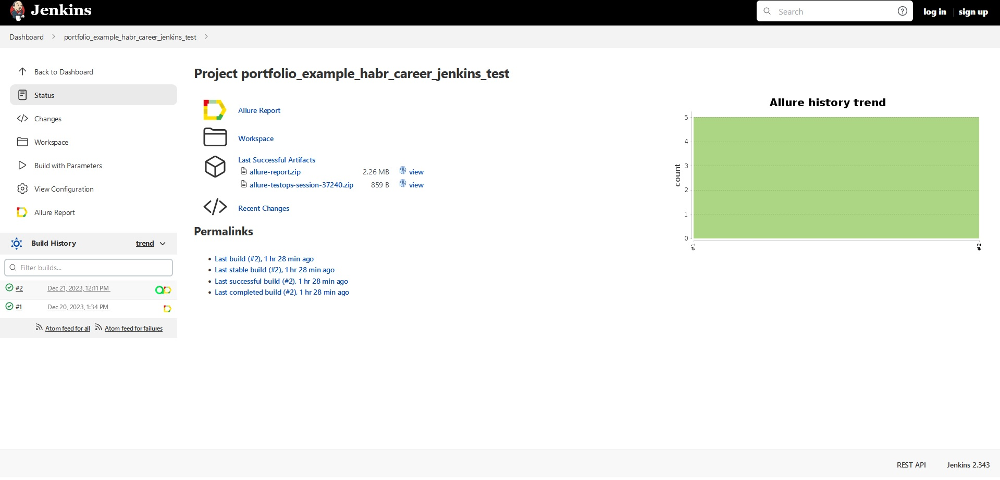
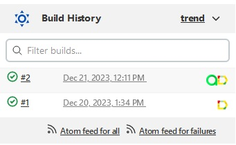
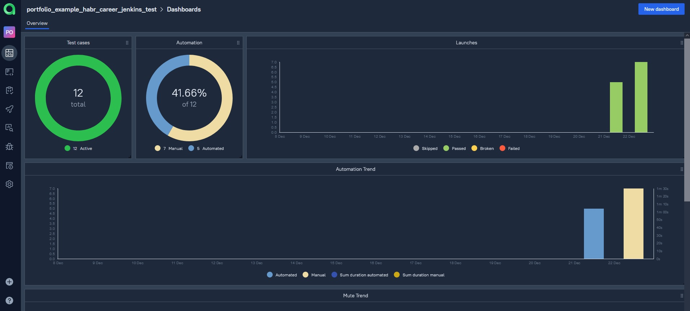
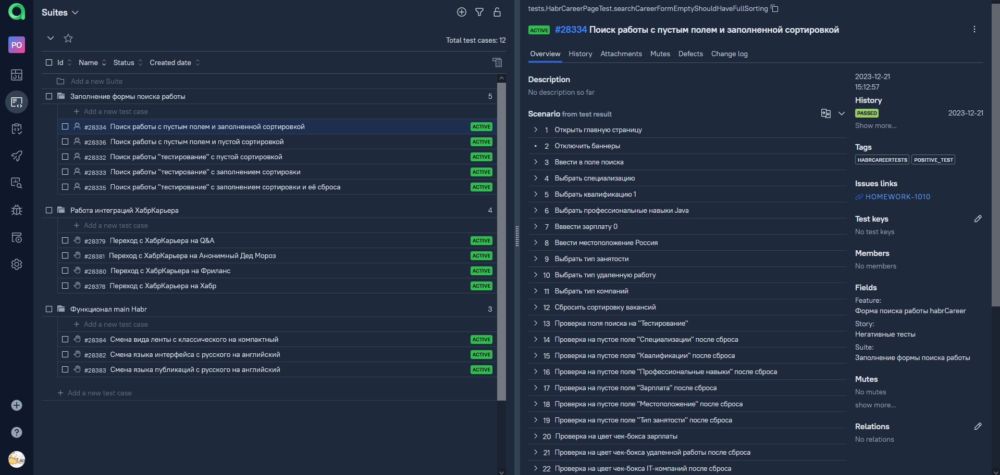
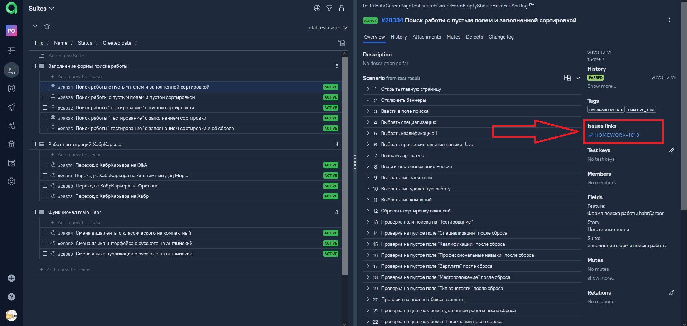
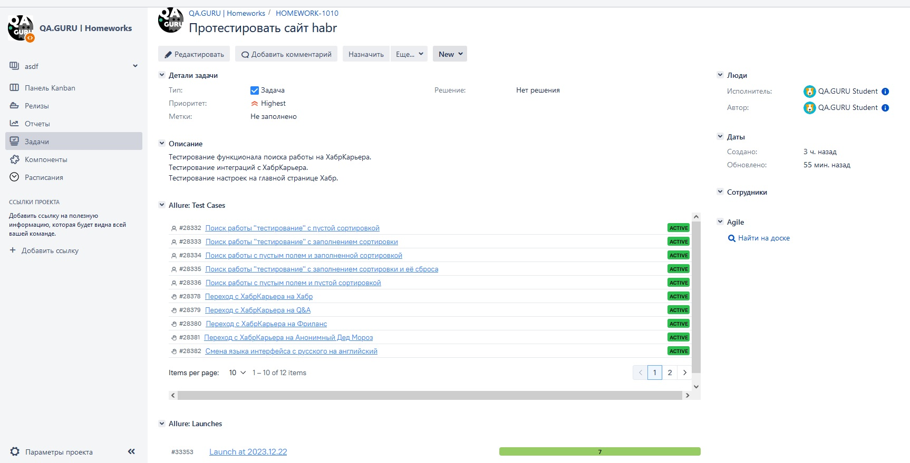
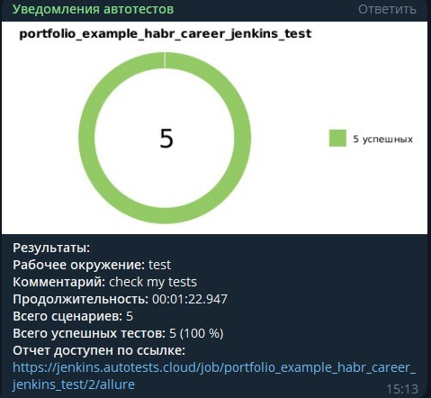
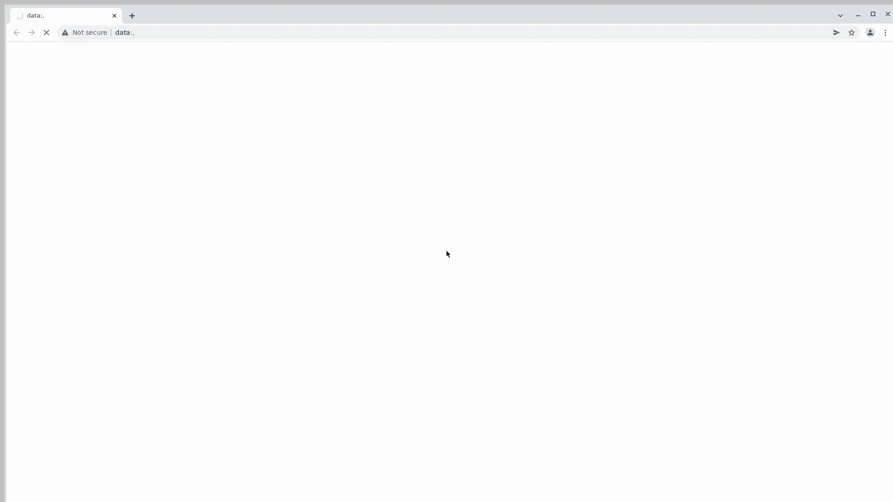

# Проект по автоматизации тестирования для [ХабрКарьера](https://career.habr.com/)


## :clipboard: Содержание:
* <a href="#tools">Используемый стек</a>
* <a href="#cases">Примеры автоматизированных тест-кейсов</a>
* <a href="#console">Запуск из терминала</a>
* <a href="#jenkins">Сборка в Jenkins</a>
* <a href="#allure">Allure отчет</a>


____
<a id="tools"></a>
## :computer:<a name="Используемый стек">**Используемый стек:**</a>

<p align="center">
<a href="https://www.java.com/"></a>
<a href="https://selenide.org/"></a>
<a href="https://aerokube.com/selenoid/"></a>
<a href="https://github.com/allure-framework/allure2"></a>
<a href="https://qameta.io/"></a>
<a href="https://gradle.org/"></a>
<a href="https://github.com/"></a>
<a href="https://www.jenkins.io/"></a>
<a href="https://web.telegram.org/a/"></a>
<a href="https://www.atlassian.com/ru/software/jira/"></a>
<a href="https://www.atlassian.com/ru/software/jira/"></a>
</p>

____
<a id="cases"></a>
## <a name="Примеры автоматизированных тест-кейсов">**Примеры автоматизированных тест-кейсов:**</a>
-  *Поиск работы c пустым полем и пустой сортировкой*
-  *Поиск работы "тестирование" c пустой сортировкой*
-  *Поиск работы \"тестирование\" с заполнением сортировки*
-  *Поиск работы c пустым полем и заполненной сортировкой*
-  *Поиск работы "тестирование" с заполнением сортировки и её сброса*

## <a name="Примеры ручных тест-кейсов">**Примеры ручных тест-кейсов:**</a>
-  *Смена языка интерфейса с русского на английский*
-  *Смена языка публикаций с русского на английский*
-  *Смена вида ленты с классического на компактный*
-  *Переход с ХабрКарьера на Хабр*
-  *Переход с ХабрКарьера на Q&A*
-  *Переход с ХабрКарьера на Фриланс*
-  *Переход с ХабрКарьера на Анонимный Дед Мороз*

____

<a id="console"></a>
## :keyboard: Запуск автотестов


***Локальный запуск тестов:***
```bash  
gradle clean test_suite
gradle clean positive_tests
gradle clean negative_tests
```
____
<a id="jenkins"></a>
## </a><a name="Сборка"></a>Сборка в [Jenkins](https://jenkins.autotests.cloud/job/portfolio_example_habr_career_jenkins_test/)</a>
### **Для запуска сборки необходимо перейти в раздел `Build with Parameters` выбрать нужные вам параметры и нажать кнопку `Build`.**
<p align="center">  

</p>
После выполнения сборки, в блоке <code>Build history</code> напротив номера сборки появятся значки <code>Allure Report</code> и <code>Allure TestOps</code>, при клике на которые откроется страница с сформированным html-отчетом и тестовой документацией соответственно.


<p align="center">   
</a>
</p>

____

<a id="allure"></a>
## </a> Allure <a target="_blank" href="https://jenkins.autotests.cloud/job/portfolio_example_habr_career_jenkins_test/allure/">отчёт</a>

## *Основная страница отчёта*

<p align="center">  
  
</p>  

## *Подробный отчёт одного из тест-кейсов*
### **На вкладке <code>Behaviors</code> можно рассмотреть каждый тест-кейс и его шаги воспроизведения, файлы(скриншоты,видео,код и т.п.).**
<p align="center">  
  
</p>

____


<a id="allureTestOps"></a>
## </a><a name="Интеграция AllureTO"></a>Интеграция с [AllureTestOps](https://allure.autotests.cloud/project/3884/dashboards)</a>
### **На `Dashboard` в `Allure TestOps` видна статистика тестирования: количество тест-кейсов, количество ручных/автоматизированных тестов, количество запусков тест-кейсов.**
<p align="center">  

</p>

Во вкладке <code>Test-cases</code> представлены все существующие тест-кейсы с подробным описанием, шагами воспроизведения, тегами, историей.

<p align="center">   

</p>

Каждый тест-кейс имеет интеграцию с <code>Jira</code>. При клике на линк, мы попадем на задачу тест-кейса в <code>Jira</code>.

<p align="center">   

</p>


____


<a id="jiraTasks"></a>
## </a><a name="Интеграция Jira"></a>Интеграция с [Jira](https://jira.autotests.cloud/browse/HOMEWORK-1010)</a>
### **Реализована интеграция `Allure TestOps` с `Jira`, в тикете отображается, какие тест-кейсы были написаны в рамках задачи и результат их прогона.**
<p align="center">  

</p>

____


##  Уведомления в Telegram с использованием бота.
### **После завершения сборки <code>Telegram</code> бот, автоматически обрабатывает информацию и отправляет сообщение с отчетом о прогоне тестов.**

<p align="center">

</p>


____


##  Видео примера запуска тестов в Selenoid.
### **В отчетах <code>Allure</code> для каждого теста прикреплен не только скриншот, но и видео прохождения теста.**
<p align="center">

</p>
